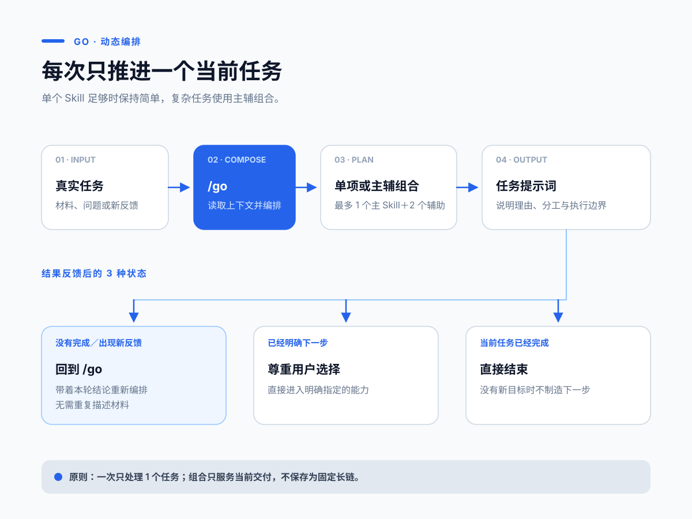

# go

> 面向创业者与内容创作者的中文 AI Skills 工具箱。把真实业务、内容与行动问题交给 Codex，获得清晰判断和可以立刻执行的下一步。

[](VERSION)
[](https://skills.sh/yaney01/skill)

**本项目仅提供 Codex 使用与部署说明。**

[快速开始](#快速开始) · [安装](#安装) · [能力一览](#能力一览) · [完整使用手册](docs/新手入门.md) · [更新记录](https://github.com/yaney01/skill/commits/main/AI%20skills)



## go 解决什么问题

你不需要先学会一套复杂的方法，也不需要知道该调用哪个工具。把当下的业务、材料、选择或卡点交给 `/go`，它会根据对话上下文判断单个 Skill 是否足够；复杂任务可以编排 1 个主 Skill 和最多 2 个辅助 Skill。

| 真实处境 | 你会得到 |
| --- | --- |
| 客户总说贵，不知道该改价格、产品还是客群 | 商业模式诊断、风险判断和验证动作 |
| 有一个选题，却做不出能被人看完的内容 | 内容方向、开头、标题与逐字稿优化 |
| 知道该做什么，却迟迟推不动 | 对行动卡点的分析和一条可开始的动作 |
| 反复面对同类选择，经验无法积累 | 可回填的决策记录、规律与阶段快照 |
| 文稿、选题、案例散落在多个文件夹 | 可持续维护的内容资产工程 |
| 本地资料很多，希望 Codex 能稳定查找和调用 | 基于文件夹的知识库导航、版本规则与使用入口 |

## 快速开始

安装完成后，直接在 Codex 中输入：

```text
/go 我做少儿编程课，已经有 40 个付费学员，但续费率很低。
我需要判断问题出在产品、定价，还是我找错了客户。
```

`/go` 会读取当前对话信息，说明推荐理由，并生成一段可以直接继续发送的提示词。完成一轮后，继续补充新的事实或反馈，再输入 `/go`，它会重新判断当前任务需要单项还是组合。

视频附有三位编号时，输入 `/go 给我所有隐藏级 skill` 可查询已发布的编号，输入 `/go <编号>` 可直接按对应方法开始。编号内容在使用时从 GitHub 读取，需要能访问 GitHub；以后新增编号无需再次更新 go。当前没有已发布的编号时，目录会如实提示。

已经知道需求时，可以直接调用具体 Skill：

```text
/go-diagnosis 我做面向宝妈的收纳咨询，客户总觉得贵。我该调整什么？
/go-content-value 这条内容适合哪些观众？可能带来什么流量和商业价值？
/go-hook 这是我短视频前 20 秒的逐字稿，帮我优化开头：……
/go-benchmark 我想研究企业服务内容账号，应该找哪些对标？
/go-knowledge 帮我把这个文件夹变成知识库，以后我想直接从里面找资料。
```

## 能力一览

| 工作目标 | 主要入口 | 常见产出 |
| --- | --- | --- |
| 判断生意、产品、定价与客户 | `/go-diagnosis` | 商业诊断、风险、验证方案 |
| 找对标并提炼可学习的部分 | `/go-benchmark` | 对标筛选与研究框架 |
| 审查经验判断并找到可信理论依据 | `/go-theory-grounding` | 命题修正、理论锚点、案例重释与适用边界 |
| 先挖掘相关领域、作者和可信理论，再研究历史同构答案 | `/go-standard-answer` | 理论锚点、案例矩阵、条件性答案与失效边界 |
| 做选题、内容、流量判断、标题与短视频 | `/go-content`、`/go-content-value`、`/go-hook`、`/go-xhs-title` | 内容方向、流量分析与可发布文案 |
| 提取短视频数据和语音文字稿 | `/go-video-extract` | 作品／账号数据、按作者和标题归档的 Markdown 文字稿 |
| 发布前检查敏感词、导流、广告与受限内容 | `/go-content-risk-check` | 机器审核信号、内容实质问题与最小修改动作 |
| 检查文稿共鸣、逻辑与传播性 | `/go-resonate`、`/go-script-flow`、`/go-spread` | 修改意见与优先级 |
| 澄清概念、目标和问题 | `/go-deconstruct`、`/go-goal`、`/go-good-question` | 可验证的定义与行动目标 |
| 处理拖延和行动受阻 | `/go-action` | 卡点分析与下一步动作 |
| 记录、复盘长期决策 | `/go-decision`、`/go-save`、`/go-restore`、`/go-report` | 本地决策档案与报告 |
| 建立和治理文件夹知识库 | `/go-knowledge` | 知识库导航、版本规则、健康检查与 SOT 分层瘦身 |
| 建立内容资产与 Codex 工作台 | `/go-content-system`、`/go-agent-migration`、`/go-install-skill` | 本地工程、主题地图与安装方案 |
| 把反复问题制作成单个 Skill | `/go-skill-maker` | 可安装 Skill、分级验证结果与可选 GitHub 发布仓库 |

完整的 33 个 Skill、适用时机、输入示例和动态导航方式，见 [新手入门与 Skill 全目录](docs/新手入门.md#skill-全目录)。

## 安装

### Codex

在终端执行：

```bash
npx -y skills add https://github.com/yaney01/skill/tree/main/AI%20skills -g --all
```

安装后重新打开 Codex，输入 `/go 新手入门` 即可开始。

### 更新

已安装 go 时，直接对 Codex 说：

```text
更新 go
```

它会同步官方 go，不会修改你在 `~/.go/` 中的存档、报告和决策记录。版本变化见 [提交记录](https://github.com/yaney01/skill/commits/main/AI%20skills)。

## go 怎样工作

```text
真实任务
   ↓
/go 读取上下文并判断单项或组合
   ↓
生成一段可直接继续发送的提示词
   ↓
入选 Skill 交付一份统一结果
   ↓
补充结果与反馈，再重新编排
```

go 每次只处理一个当前任务。单个 Skill 能覆盖时保持简单；任务包含独立且必要的要求时，使用主辅组合共同交付一份结果。

## 知识库与本地记录

- 想查看数据范围和字段，阅读 [原子库说明](知识库/原子库/README.md)。
- 想构建自己的 RAG，可使用 `知识库/原子库/atoms.jsonl`。
- 想了解各项方法，浏览 [Skill 知识包](知识库/Skill知识包)。
- 想让 Codex 把自己的本地文件夹直接当作知识库，使用 `/go-knowledge` 建立导航并持续查找、收录和调用资料。
- 想跨对话保留工作，使用 `/go-save`、`/go-restore` 与 `/go-report`。数据默认保存在用户本机的 `~/.go/`。
